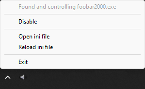

# Auto-Duck BGM

**Auto-Duck BGM can reduce or mute audio from a program when any other audio plays.**

## Features

- Very low memory and CPU usage.
- Bypass the effect, returning the volume to normal.
- Smooth fading between minimum and maximum volume.
- Runs in the taskbar notification area with settings available on right-click.

This program is Windows only and uses the Windows Core Audio API.

Similar to:

- [Background Music](https://github.com/kyleneideck/BackgroundMusic), a macOS audio utility with an auto-pause feature.
- [Automatic Volume Mixer](https://github.com/Klocman/Automatic-Volume-Mixer), which can achieve a similar effect by automating Windows Volume Mixer based on rules.

## Settings

The settings can be configured from the `.ini` file within the same folder as the executable (the `.ini` file will generate on the first run). You may also open and reload the `.ini` file using the relevant options from the tray area icon's menu.

Settings that can be configured:

- The controlled executable.
- The minimum and maximum volume while the program is running.
- The volume that any other program must exceed to trigger the duck.
- The number of consecutive times the trigger volume must be exceeded to trigger the duck, and, separately, the number of consecutive times the volume must be below to trigger the unduck.
- Changing the duration of the fade between the minimum and maximum volume.
- The volume that the controlled executable is set to when the program is bypassed or quit.
- Set excluded applications that are ignored when playing audio.
- Run a custom Windows command on duck or unduck (e.g., to play or pause music).

## Credits

Icons from Yusuke Kamiyamane's Fugue Icons are available under a [Creative Commons Attribution 3.0 License](http://creativecommons.org/licenses/by/3.0/) - [https://p.yusukekamiyamane.com/](https://p.yusukekamiyamane.com/)
